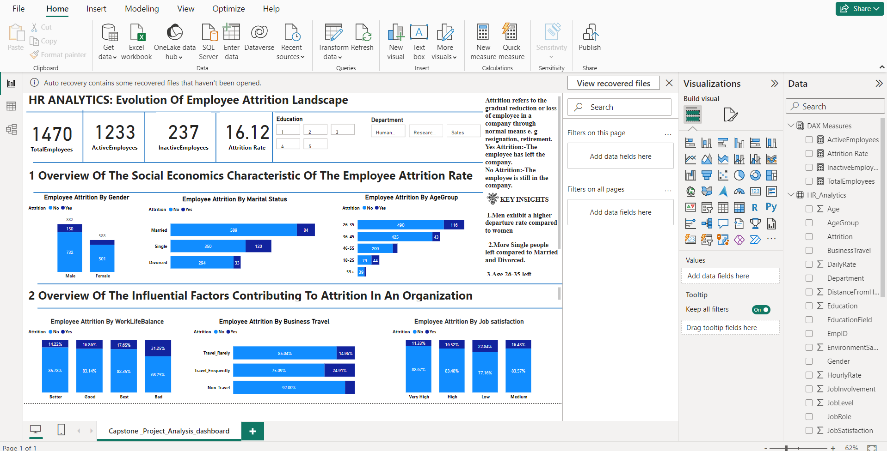
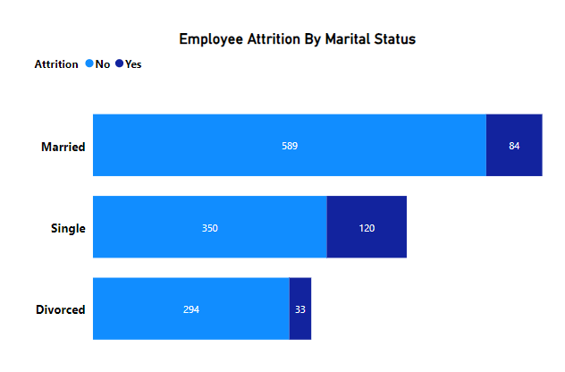
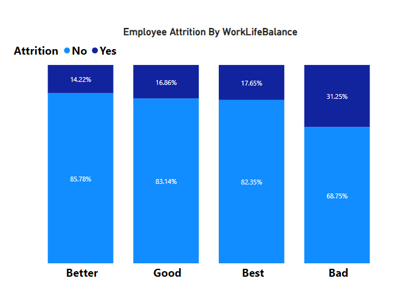
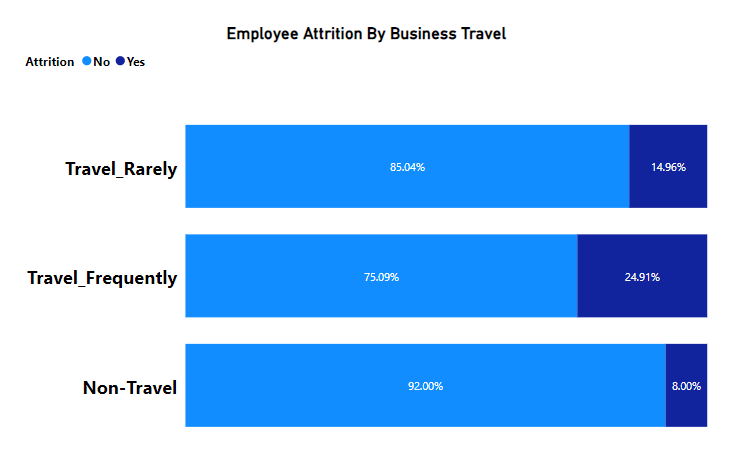

# Human_Resource_Analysis_with_powerBI
## Unlocking Human Resource Insights For Valuable Business Decisions ##

## Introduction

INTRODUCTION: This **HR analytics** project examines the dynamics of employee attrition within an organization, focusing on two key dimensions. Firstly, I explore the socio-economic characteristics such as age group, gender, and marital status that shape the attrition landscape. Secondly, I analyzed influential factors like business travel, work-life balance, and relationship satisfaction to unravel the underlying contributors to employee departures. Through this comprehensive analysis, we aim to gain actionable insights that inform strategic decision-making for talent retention and organizational well-being.

## Problem statement
The dataset was analyzed in other to answer the following questions:
- Investigate the employee attrition trends by gender.
- Analyze employee attrition across different age groups.
- Examine the relationship between employee attrition and marital status.
- Examine the connection between employee attrition and business travel frequency.
- Evaluate the impact of work-life balance on employee attrition.
- Explore the relationship between employee Job satisfaction and attrition.

## Skills And Concept Demostrated
The following powerBI features were incorporated -DAX Concept:Calculated column and created measures for effective analysis and valuable insights

## Dataset Description
Link to the dataset used:

https://www.kaggle.com/datasets/saadharoon27/hr-analytics-dataset

With the original dataset,the aim was to provide meaningfull insights into Employee attrition rates within an Organization,study and understand valuable insights that influence workplace stability and to showforth effective insights and recommendation for Organization uprightness.
The Human_Resource dataset has 38 columns and 1470 rows

## Data Cleaning
- **Handling Missing values**: The null values in the dataset was replaced with zero values because from my understanding of the dataset,they are the rows and 
    column where the employee is no longer in the Organization.
- **Checking the data type**: The data type of each column was checked accurately to ensure correct data type for each column
- **Dealing with duplicate**: The duplicate in the dataset was removed.
  

## DATA WRANGLING
- In conducting a comprehensive analysis,I thoroughly understand the structure and characteristics of the dataset.
- I defined the analysis goals to provide a clear direction of the analysis.
- In optimizing the dataset for analysis,I removed redundant columns(Irrelevant columns).The columns are Over 18 years,standard hour,stock option level,years with current managers,employee count,Employee Number.
- I created a new table called DAX for my new measures,which are Total Employee,Active Employee,Inactive Employee and Attrition Rates in other to effectively analyzed the data.
- Re encoding of Job satisfaction column1=low,2=medium,3=high and 4=very high
- Re encoding of work life balance column with 1=Bad,2=Good,3=Better,4=Best
- Relabelling of travel_rarely and travel rarely by replace values methods in other to reduce the unique values in business travel column from four to three and to make it more manageable for analysis.
  
  ### Dax measure was created in other to keep all the measure which is shown in the dataview below

  

  ## Analysis
  
  ### The socio-economics characteristics of the employee attrition are analyzed below

  

  The organization employs more men than women. Men show a higher attrition rate with the highest count of "YES" departures, while women have the lowest "No" attrition count, indicating lower departure rates.

  

Single has the highest amount of turnover compared to Married and Divorced,because they are more mobile and open to job changes compare to married and divorced who has family commitment.
  

Employees tend to depart between ages 26-35, possibly exploring opportunities. The departure trend stabilizes and reaches a break-even point at age 55 and above.

### An overview of the factors influencing employees' decisions to stay or leave an organization

High turnover is observed among employees with poor work-life balance, emphasizing the crucial role of a balanced professional and personal life.

Employees with lower job satisfaction levels exhibit higher turnover rates compared to those with medium, high, and very high job satisfaction. This highlights the critical impact of job satisfaction on employee retention.

Employees who travel more frequently experience higher turnover rates. This may be linked to factors such as burnout, job dissatisfaction, or the challenges of maintaining work-life balance while frequently on the move.

## Conclusions and Recommendations 

- Recognize and reward employee engagement to maintain a healthy active workforce.
- Implement strategies to re-engage inactive employees, possibly through targeted training or mentorship programs.
- Develop targeted career development programs and engagement initiatives for employees in this age group
- Enhance organizational flexibility by implementing hybrid work models, allowing employees a balance between remote and office work for increased satisfaction.
- Foster a sense of belonging by creating a workplace environment that feels like home, cultivating a strong connection and integration within the company culture.
- Ensure competitive compensation to recognize and reward employees for their contributions, fostering motivation, job satisfaction, and overall retention.
- Prevent dullness by introducing job variety, allowing employees to engage in diverse tasks, promoting skill development, and sustaining enthusiasm in their 
  roles.

